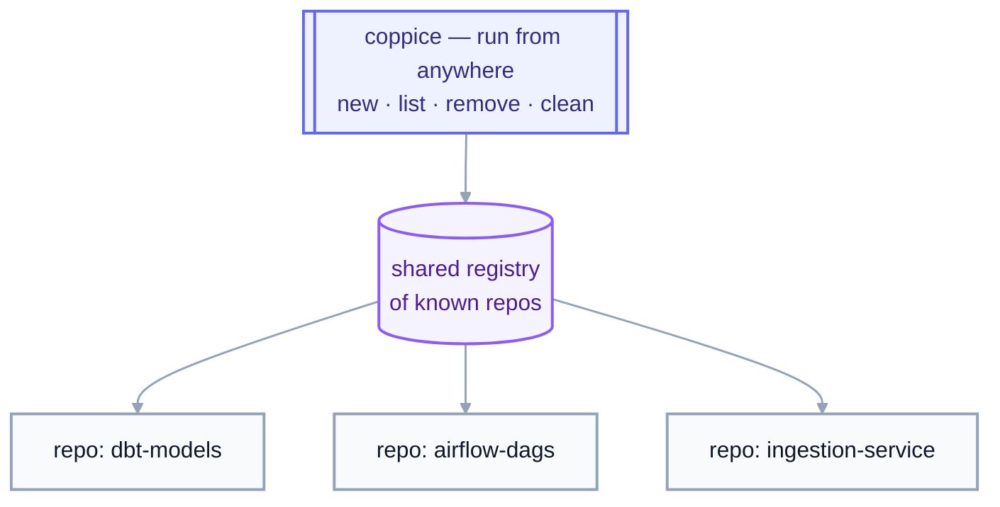

# coppice

[](https://github.com/luiul/coppice/actions/workflows/ci.yml)
[](LICENSE)

A path-based CLI for managing git worktrees across every repo on your
machine, from a single set of commands.

Built on top of [`wt`](https://worktrunk.dev) (worktrunk), which does the
actual worktree work (creating them, running hooks, etc.). `coppice` adds
what `wt` doesn't: commands that reach across *all* your repos from
*anywhere* on disk.

## Why

Working on more than one thing in a repo usually means switching
branches one at a time: stash, checkout, work, then stash again to switch
back. That switching is sequential, even when the tasks themselves
aren't.

Git worktrees fix this: each branch gets its own directory, all sharing
the same `.git` history, so several branches can be checked out at once
instead of switched between. `coppice` makes creating and cleaning up
those worktrees a one-liner, from anywhere on disk, whether that's one
repo or twenty.

### Parallelize work in a single repo

Each worktree is a full, isolated checkout sharing the same `.git`
history, so a human and any number of agents can work the same repo at
once: one agent adding a column, another fixing a DAG's schedule, you
debugging a failing pipeline, none of them blocking each other, none of
them waiting for a branch switch:


`cop new ~/dbt-models` (or a bare `cop ~/dbt-models`) spins up the next
worktree for that repo; `cop clean` sweeps up whichever ones are done,
merged, and idle, once the work above is finished.

### Reach every repo, from anywhere

The catch with juggling worktrees across *several* repos, your dbt
project, your Airflow DAGs, your ingestion jobs, is that it's easy to lose
track of what's checked out where, and stale ones quietly pile up on disk.
`coppice` tracks every repo it's touched in a shared registry, so
`list`/`clean` sweep across all of them, no matter which one you're
standing in:



The registry is what makes this possible: each command takes an explicit
**path**, or defaults to every repo it already knows about, instead of
relying on your current directory. `cop new ~/dbt-models` works the same
whether you're standing in `~/dbt-models`, in `~/airflow-dags`, or in your
home directory.

## Concepts

- **Repo**: a git repository, identified by its root directory (where
  `.git` lives). `coppice` works across as many repos as you have on disk,
  not just the one you're standing in.
- **Commit**: a snapshot of the repo's files at a point in time, plus a
  pointer to its parent commit(s). Every worktree of a repo shares the same
  history of commits; making a commit in one worktree makes it visible to
  every other worktree of that repo immediately.
- **Branch**: a named pointer to a commit, e.g. `add-customer-id-column`.
  It's cheap: git can have many branches with none of them checked out
  anywhere. Normally you work on one branch at a time in one directory,
  and switching (`git switch`/`git checkout`) requires committing or
  stashing first.
- **Worktree**: a separate, physical directory on disk, checked out to one
  branch, linked to the same underlying `.git` history as every other
  worktree of that repo. Instead of one directory that changes what's
  checked out over time, you get several directories, each checked out to
  a specific branch, at the same time, no stashing, no switching. A
  repo's original checkout, the one where `.git` itself lives, is its
  **main worktree**; every additional one is a **linked worktree**.
- **Current worktree**: whichever one you happen to be standing in when
  you run a command, shown as `[current]` in `cop list`.
- **Registry**: the shared list of repos `coppice`/`wt` have seen before
  (`~/.cache/wt/known-repos`). It's what lets `cop list`/`cop remove`/`cop
  clean` operate across every repo you've touched, not just the one
  you're standing in.
- **Scope**: the set of repos a command like `list`/`remove`/`clean`
  operates over. An explicit path (or `--repo`) scopes to just that one
  repo; omitting it defaults to every repo in the registry, plus the one
  you're standing in.

### Worktree status: dirty, merged, stale

Three states `cop list`/`cop clean` report on and act on differently:

- **Dirty**: the worktree has uncommitted changes (staged, modified,
  untracked, deleted, or renamed). `clean` always skips dirty worktrees;
  `remove` refuses them unless you pass `--force`/`-f`.
- **Merged**: the branch has been merged into the repo's default branch.
  Controls whether `remove`/`clean` also delete the branch itself (kept by
  default unless merged, or `-D`/`--force-delete` is passed), and it's
  what `clean --merged` filters on instead of age.
- **Stale (dangling)**: the worktree's directory is already gone from disk
  (removed outside `coppice`/`wt`) but git still has a record of it.
  `clean` always removes these, regardless of age or the `--merged` flag.

### Branches vs. worktrees, in coppice's commands

coppice identifies things by **branch name** where it can, since that's
what you already think in, but what its commands actually create, list,
or remove is that branch's **worktree**, not the branch itself:

| Command | Takes | Does |
|---|---|---|
| `cop new PATH [--branch B] [--base REF]` | a repo **path** | creates branch `B` if it doesn't exist yet (from `REF`, default: `wt`'s default branch), plus a worktree checked out onto it |
| `cop list [PATH]` | nothing, or a repo path | lists worktrees, one per checked-out branch, **not** every branch in the repo |
| `cop remove BRANCH...` | one or more branch **names** | deletes each branch's worktree directory; the branch itself survives unless it's merged or `-D`/`--force-delete` is passed |
| `cop clean` | filters (age or `--merged`) | the bulk version of `remove`: same branch-vs-worktree distinction applies |

A branch with no worktree still exists, `git log`/`git checkout` see it
fine, it's just not checked out anywhere, so it won't show up in `cop
list` and there's nothing for `cop remove`/`cop clean` to act on.

## What it looks like

```console
$ cop new ~/dbt-models --branch add-customer-id-column
Worktree branch: add-customer-id-column
Created worktree for add-customer-id-column @ /Users/you/dbt-models/.worktrees/add-customer-id-column

$ cop list
dbt-models:
  add-customer-id-column  2d [current]
  fix-ingestion-retry  5d

airflow-dags:
  update-dag-schedule  1d
  debug-failing-pipeline  9d (dirty)

Total: 4 worktree(s) across 2 repo(s).

$ cop clean --dry-run
Scanning 2 repo(s) for worktrees older than 14d...

airflow-dags:
  rm    16d  backfill-2023-orders  (240M on disk, merged, branch will be deleted)

Total reclaimable: 240M across 1 worktree(s).
Dry run, nothing removed.
```

## Install

**Prerequisite:** [`wt`](https://worktrunk.dev) (worktrunk) must already be
installed and on `PATH`; `coppice` shells out to it for every worktree
operation. If it's missing, commands fail fast with a clear message. See
[worktrunk.dev](https://worktrunk.dev) for install instructions.

```bash
uv tool install coppice
# or run ad hoc, no install:
uvx coppice ...
```

Then, so `cop new` can `cd` you into the worktree it creates, add shell
integration to your rc file:

```bash
# zsh (~/.zshrc) or bash (~/.bashrc)
eval "$(coppice shell init zsh)"   # or: bash
```

This defines `coppice` and its shorter alias `cop` as shell functions,
behaving identically; use whichever you prefer.

Two more tools are auto-detected and used if present, neither is required:
[`fzf`](https://github.com/junegunn/fzf) powers `cop remove`'s interactive
picker, and [`gh`](https://cli.github.com) lets `cop clean` skip branches
with an open PR. Without them, those features just degrade gracefully.

## Usage

```bash
cop new ~/dbt-models                     # create branch + worktree for the repo at ~/dbt-models (or reuse it)
cop new .                                # ...for the repo you're standing in
cop new . --branch update-dag-schedule   # skip the prompt, use a specific branch name
cop list                                 # list worktrees (not all branches) across every known repo
cop list ~/dbt-models                    # ...just this one
cop list --json                          # same, as JSON
cop remove add-customer-id-column        # remove a worktree by branch name (branch itself kept unless merged/-D)
cop remove a b --repo dbt-models --yes
cop remove                               # ...or omit the branch for an fzf multi-select picker
cop clean --dry-run                      # preview worktrees (not branches) older than 14 days, size + merge status
cop clean --yes                          # remove them (skips dirty worktrees and ones with an open PR)
cop clean --merged                       # sweep every worktree on a merged branch instead, regardless of age
cop clean 7 --repo dbt-models --merged   # ...scoped to one repo, merged only
cop status                               # is wt on PATH, what's in the shared registry
```

Run `cop --help` or `cop <command> --help` for the full option list. A
bare `cop PATH` is shorthand for `cop new PATH`.

### How the registry works

`list`/`remove`/`clean` operate over a registry of "known repos"
(`~/.cache/wt/known-repos`), not just your current directory. It's
populated automatically, either by `wt`'s own `registry` post-start hook,
or, if that hook isn't configured, by `coppice new` itself the first time
it touches a repo. Once a repo has been touched once, it stays visible to
every other command from anywhere on disk.

### Shell integration, in more detail

`coppice`/`cop` is a plain executable, not a shell function, so it can't
change your shell's working directory on its own, a subprocess's `cd`
never outlives the subprocess. (`wt` has the same problem and solves it
the same way, via `wt config shell install`.)

`coppice shell init <zsh|bash>` prints wrapper functions that run the real
binary with an env var pointed at a temp file, then `cd` there afterward
if `new` wrote a path into it (only `new` does, and only on success).
Without the wrapper, `new` still works, it just prints the resulting path
instead of moving you there:

```bash
cd "$(cop new . --branch update-dag-schedule | tail -1 | sed 's/.* @ //')"
```

## Status

Early days. `new`, `list`, `remove` (with an interactive `fzf` picker),
`clean`, `status`, and shell integration cover the daily loop. See [open
issues](https://github.com/luiul/coppice/issues) for what's not there yet.

## Development

```bash
uv sync --group dev
uv run pytest
uv run ruff check .
uv run ty check
```

## License

MIT, see [LICENSE](LICENSE).
