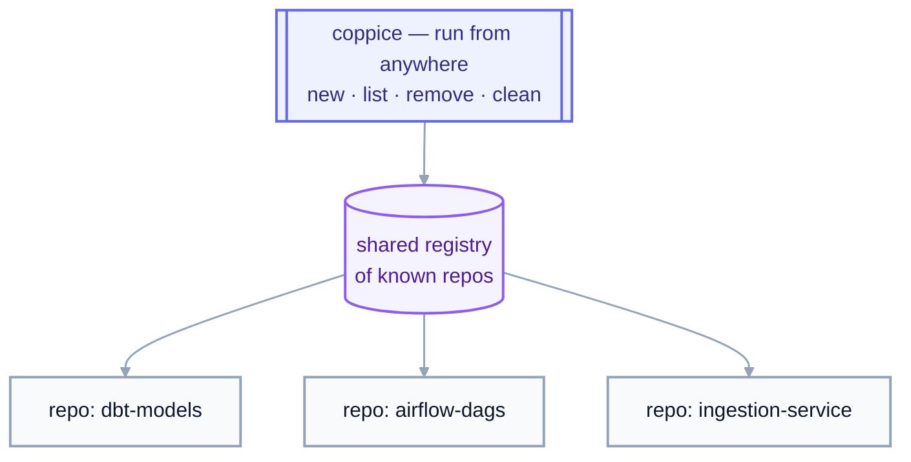
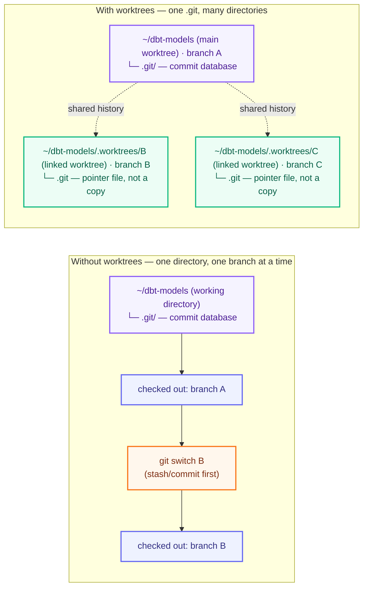

# coppice

[](https://github.com/luiul/coppice/actions/workflows/ci.yml)
[](LICENSE)

A path-based CLI for managing git worktrees across every repo on your
machine, from a single set of commands.

Built on top of [`wt`](https://worktrunk.dev) (worktrunk), which does the
actual worktree work: creating them, and running the hooks that turn a
bare checkout into a set-up dev environment. `coppice` adds what `wt`
doesn't: commands that reach across *all* your repos from *anywhere* on
disk.

## Why

Working on more than one thing in a repo usually means switching
branches one at a time: stash, checkout, work, stash again. That's
sequential even when the tasks aren't.

Git worktrees fix that: each branch gets its own directory, all sharing
the same `.git` history, so several branches can be checked out at once.
But `wt` (and raw `git worktree`) only operate on one repo, from inside
it.

**What `coppice` adds:** commands that create, list, and clean up
worktrees as one-liners, from anywhere on disk, across every repo
you've touched.

### Parallelize work in a single repo

Each worktree is a full, isolated checkout sharing the same `.git`
history, so a human and any number of agents can work on the same repo at
once, each in their own directory: one agent adding a column, another
fixing a DAG's schedule, you debugging a failing pipeline. No branch
switching, no blocking each other:


`cop new ~/dbt-models` (or a bare `cop ~/dbt-models`) spins up the next
worktree; once that work is done, `cop clean` sweeps up whichever ones
are merged and idle.

### Reach every repo, from anywhere

Juggling worktrees across several repos, your dbt project, your Airflow
DAGs, your ingestion jobs, makes it easy to lose track of what's checked
out where, and stale worktrees pile up unnoticed. `coppice` tracks every
repo it's touched in a shared registry, so `list`/`clean` sweep across
all of them, regardless of which one you're standing in:



The registry is what makes this possible: each command takes an explicit
**path**, or defaults to every repo it already knows about, instead of
relying on your current directory. `cop new ~/dbt-models` works the same
from `~/dbt-models`, `~/airflow-dags`, or your home directory.

### Automate everything that happens around a worktree

A plain `git worktree add` gets you an empty checkout: no `.venv`, no
editor window, no local `.env`. Closing that gap is `wt`'s job, and it's
the other big reason coppice builds on `wt` instead of shelling out to
raw git: `wt` runs user-defined **hooks**, shell commands fired at points
in a worktree's life (`post-start`, `pre-remove`, and more), scoped to
every repo or to one specific repo by URL. A `post-start` hook is what
turns `cop new` from an empty checkout into a ready one every time, and
it's also how coppice's own registry gets populated (see [How the
registry works](#how-the-registry-works)).

For real examples, see [my `wt`
config](https://github.com/luiul/dotfiles/blob/main/worktrunk/.config/worktrunk/config.toml):
`.venv` symlinking, copying gitignored config, opening an editor,
project-scoped `dbt deps`, and a `pre-remove` guard against removing
protected branches. Run `wt config create --project` to scaffold your
own; see the [worktrunk hooks docs](https://worktrunk.dev) for the full
reference.

## Concepts

- **Repo**: a git repository, identified by its root directory, where
  `.git` lives: the database of every commit and branch. `coppice` works
  across every repo on disk, not just the one you're standing in.
- **Commit**: a snapshot of the repo's files, plus a pointer to its
  parent commit(s). Every worktree of a repo shares the same commit
  history, so a commit made in one worktree is visible in every other
  worktree immediately.
- **Branch**: a named pointer to a commit, e.g. `add-customer-id-column`.
  Cheap: git can have many branches with none checked out anywhere.
  Without worktrees you work on one branch at a time in one directory,
  and switching (`git switch`/`git checkout`) requires committing or
  stashing first.
- **Worktree**: a separate directory on disk checked out to one branch,
  reading from the same `.git` database as every other worktree of that
  repo (details in [One `.git`, many working
  directories](#one-git-many-working-directories)). A worktree's identity
  is its directory, not its branch: git refuses to check out the same
  branch in two worktrees at once, so switching between worktrees is just
  changing directories, no stashing required.
- **Main worktree**: the original checkout, the one that actually holds
  `.git`, as opposed to a **linked** worktree's pointer file (see [One
  `.git`, many working directories](#one-git-many-working-directories)).
  It's the repo itself, not something `coppice` creates or manages
  alongside it, so `cop list`/`status` never count or list it as "a
  worktree"; its branch name shows up folded into the repo heading
  instead (e.g. `(main: master)`), and `remove`/`clean` always skip it.
- **Current worktree**: whichever one you happen to be standing in when
  you run a command, shown as `[current]` in `cop list`.
- **Registry**: the shared list of repos `coppice`/`wt` have seen before
  (`~/.cache/wt/known-repos`), letting `cop list`/`remove`/`clean`
  operate across every repo you've touched.
- **Scope**: the set of repos a command like `list`/`remove`/`clean`
  operates over: an explicit path (or `--repo`) scopes to just that
  repo; omitting it defaults to every repo in the registry.

### One `.git`, many working directories

`.git` is a **directory holding a database**: every commit, branch, and
the history tying them together, stored in git's own object format
rather than plain files. It lives *inside* your working directory, e.g.
`~/dbt-models/.git`, alongside the files you actually edit.

A normal checkout has exactly one working directory with `.git` inside
it, so switching branches means mutating that same directory in place:
stash or commit, then `git switch`, over and over. A worktree adds
another working directory elsewhere on disk, but not its own copy of
`.git`; only the original directory (the **main worktree**) holds the
real database. Every other (**linked**) worktree just holds a small
`.git` *file* pointing back to it, so all of them read and write the
same history:



A worktree's identity is its directory, not its branch; the branch is
just what it's checked out to, set at creation (`cop new`/`git worktree
add`). Git enforces the constraint that makes this safe: the same branch
can never be checked out in two worktrees at once.

### Worktree status: dirty, merged, stale

Three states `cop list`/`cop clean` report on and act on differently:

- **Dirty**: the worktree has uncommitted changes (staged, modified,
  untracked, deleted, or renamed). `clean` always skips dirty worktrees;
  `remove` refuses them unless you pass `--force`/`-f`.
- **Merged**: the branch has been merged into the repo's default branch.
  `remove`/`clean` keep the branch by default unless it's merged, or
  `-D`/`--force-delete` is passed. It's also what `clean --merged` filters
  on, instead of age.
- **Stale (dangling)**: the worktree's directory is already gone from disk
  (removed outside `coppice`/`wt`) but git still has a record of it.
  `clean` always removes these, regardless of age or the `--merged` flag.

### Branches vs. worktrees, in coppice's commands

coppice identifies things by **branch name**, since that's what you
think in, but what its commands actually create, list, or remove is
that branch's **worktree**, not the branch itself:

| Command | Takes | Does |
|---|---|---|
| `cop new PATH [--branch B] [--base REF]` | a repo **path** | creates branch `B` if it doesn't exist yet (from `REF`, default: `wt`'s default branch), plus a worktree checked out onto it |
| `cop list [PATH]` | nothing, or a repo path | lists worktrees, one per checked-out branch, **not** every branch in the repo, and **not** the main worktree (see [Concepts](#concepts)) |
| `cop remove BRANCH...` | one or more branch **names** | deletes each branch's worktree directory; the branch itself survives unless it's merged or `-D`/`--force-delete` is passed |
| `cop clean` | filters (age or `--merged`) | the bulk version of `remove`: same branch-vs-worktree distinction applies |

A branch with no worktree still exists; `git log`/`git checkout` see it
fine, it's just not checked out anywhere. It won't show up in `cop list`,
and there's nothing for `cop remove`/`cop clean` to act on.

## What it looks like

```console
$ cop new ~/dbt-models --branch add-customer-id-column
Worktree branch: add-customer-id-column
Created worktree for add-customer-id-column @ /Users/you/dbt-models/.worktrees/add-customer-id-column

$ cop list
dbt-models:
  add-customer-id-column  2d [current]
  fix-ingestion-retry  5d

airflow-dags:
  update-dag-schedule  1d
  debug-failing-pipeline  9d (dirty)

Total: 4 worktree(s) across 2 repo(s).

$ cop clean --dry-run
Scanning 2 repo(s) for worktrees older than 14d...

airflow-dags:
  rm    16d  backfill-2023-orders  (240M on disk, merged, branch will be deleted)

Total reclaimable: 240M across 1 worktree(s).
Dry run, nothing removed.
```

## Install

**Prerequisite:** [`wt`](https://worktrunk.dev) (worktrunk) must already be
installed and on `PATH`; `coppice` shells out to it for every worktree
operation. If it's missing, commands fail fast with a clear message. See
[worktrunk.dev](https://worktrunk.dev) for install instructions.

```bash
uv tool install coppice
# or run ad hoc, no install:
uvx coppice ...
```

Then, so `cop new` can `cd` you into the worktree it creates, add shell
integration to your rc file:

```bash
# zsh (~/.zshrc) or bash (~/.bashrc)
eval "$(coppice shell init zsh)"   # or: bash
```

This defines `coppice` and its shorter alias `cop` as shell functions,
behaving identically; use whichever you prefer.

Three more tools are auto-detected, none required:
[`fzf`](https://github.com/junegunn/fzf) powers `cop remove`'s interactive
picker, [`gh`](https://cli.github.com) lets `cop clean` skip branches
with an open PR, and VS Code's [`code`
CLI](https://code.visualstudio.com/docs/configure/command-line) opens a
new window on every `cop new` (pass `--no-code` to skip). Without them,
those features just degrade gracefully.

## Usage

```bash
cop new ~/dbt-models                     # create branch + worktree for the repo at ~/dbt-models (or reuse it)
cop new .                                # ...for the repo you're standing in
cop new . --branch update-dag-schedule   # skip the prompt, use a specific branch name
cop new ~/dbt-models/pipelines/marketing/attribution  # a project deep inside a monorepo: lands you (and VS Code) in the matching subdirectory of the new worktree, not just its root
cop new . --no-code                      # skip opening VS Code even if `code` is on PATH
cop list                                 # table of worktrees (age, size, dirty/merge status) across every known repo
cop list ~/dbt-models                    # ...just this one
cop list --no-size                       # skip the (directory-walking) size column, for a faster listing
cop list --json                          # same data, as JSON
cop remove add-customer-id-column        # remove a worktree by branch name (branch itself kept unless merged/-D)
cop remove a b --repo dbt-models --yes
cop remove                               # ...or omit the branch for an fzf multi-select picker
cop clean --dry-run                      # preview worktrees (not branches) older than 14 days, size + merge status
cop clean --yes                          # remove them (skips dirty worktrees and ones with an open PR)
cop clean --merged                       # sweep every worktree on a merged branch instead, regardless of age
cop clean 7 --repo dbt-models --merged   # ...scoped to one repo, merged only
cop status                               # is wt on PATH, table of the shared registry (worktree count, size, health)
```

Run `cop --help` or `cop <command> --help` for the full option list. A
bare `cop PATH` is shorthand for `cop new PATH`.

### How the registry works

`list`/`remove`/`clean` operate over a registry of known repos
(`~/.cache/wt/known-repos`), not just your current directory. It's
populated automatically: by `wt`'s own `registry` post-start hook if
configured (see [Automate everything that happens around a
worktree](#automate-everything-that-happens-around-a-worktree)), or
otherwise by `coppice new` the first time it touches a repo. After that,
the repo stays visible to every command from anywhere on disk.

### Shell integration, in more detail

`coppice`/`cop` is a plain executable, not a shell function, so it can't
change your shell's working directory on its own: a subprocess's `cd`
never outlives the subprocess. (`wt` has the same problem, and solves it
the same way, via `wt config shell install`.)

`coppice shell init <zsh|bash>` prints wrapper functions that run the real
binary with an env var pointing at a temp file, then `cd` there if `new`
wrote a path into it (only `new` does, and only on success). Without the
wrapper, `new` still works, it just prints the path instead of moving you
there:

```bash
cd "$(cop new . --branch update-dag-schedule | tail -1 | sed 's/.* @ //')"
```

## Status

Early days. `new`, `list`, `remove` (with an interactive `fzf` picker),
`clean`, `status`, and shell integration cover the daily loop. See [open
issues](https://github.com/luiul/coppice/issues) for what's not there yet.

## Development

```bash
uv sync --group dev
uv run pytest
uv run ruff check .
uv run ty check
```

## License

MIT, see [LICENSE](LICENSE).
