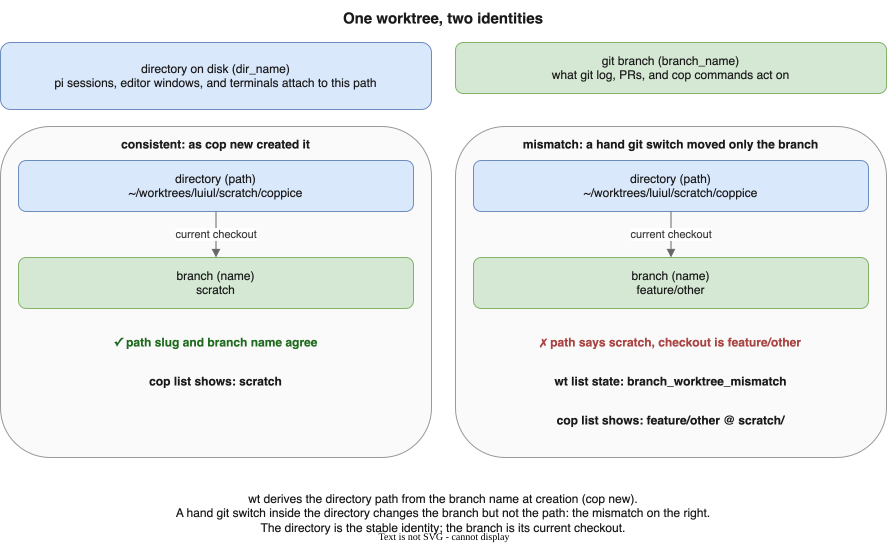

# coppice

[](https://github.com/luiul/coppice/actions/workflows/ci.yml)
[](LICENSE)

A path-based CLI for managing git worktrees across every repo on your
machine, from a single set of commands. Built on top of
[`wt`](https://worktrunk.dev) (worktrunk), which does the actual worktree
work; `coppice` adds what `wt` doesn't: commands that reach across *all*
your repos from *anywhere* on disk.

## Why

Git worktrees give each branch its own directory, all sharing one `.git`
history, so several branches can be checked out at once. But `wt` (and
raw `git worktree`) only operate on one repo, from inside it. `coppice`
turns that into a cross-repo workflow:

- **Parallelize work in a single repo.** A human and any number of
  agents work in the same repo at once, each in their own worktree. No
  stashing, no branch switching.
- **Reach every repo, from anywhere.** A shared registry tracks every
  repo `coppice` has touched, so `list`/`clean` sweep all of them from
  any directory.
- **Automate everything around a worktree.** `wt`'s lifecycle hooks turn
  `cop new` from an empty checkout into a ready dev environment: venv,
  `.env`, editor window.

The long version, with diagrams: [docs/why-worktrees.md](docs/why-worktrees.md).
How coppice relates to `wt`, understory, and canopy:
[docs/ecosystem.md](docs/ecosystem.md).

## Install

**Prerequisite:** [`wt`](https://worktrunk.dev) (worktrunk) on `PATH`;
`coppice` shells out to it for every worktree operation. With the repo
cloned:

```bash
uv tool install -e .
```

Then, so `cop new` can `cd` you into the worktree it creates, add shell
integration to your rc file:

```bash
# zsh (~/.zshrc) or bash (~/.bashrc)
eval "$(coppice shell init zsh)"   # or: bash
```

`fzf` (interactive picker for `cop remove`) and `gh` (open-PR detection
for `cop clean`) are auto-detected, neither required.

## Usage

```bash
cop new ~/dbt-models          # create branch + worktree for a repo, from anywhere
cop sync                      # merge each repo's base remote into every worktree
cop list                      # worktrees across every known repo
cop clean --dry-run           # preview worktrees older than 14 days
cop remove my-branch          # remove a worktree by branch name
```

Full reference, prompt behavior, and safety rails:
[docs/commands.md](docs/commands.md). A full terminal session:
[docs/demo.md](docs/demo.md).

## Concepts

### Vocabulary

Defined once, used everywhere:

- **Repo**: the `.git` database, every commit and branch, plus by
  convention the whole project around it. `coppice` works across every
  repo on disk, not just the one you're standing in.
- **Project**: the codebase as one unit: its repo plus every worktree
  attached to it. Named by the repo's main directory basename.
- **Branch**: a ref, a named pointer to a commit. It lives in the repo
  and has no location on disk.
- **Worktree**: one working directory attached to a repo, checked out to
  one branch, sharing the same `.git` history as every other worktree.
  The **main worktree** is the original checkout and holds the real
  `.git` directory; every **linked worktree** (everything `cop` creates)
  holds a small `.git` file pointing back to it.
- **Checkout**: the association between one worktree and one branch. Git
  enforces: one branch in at most one worktree at a time.
- **Path**: a worktree's directory on disk. A worktree's identity is its
  path: pi sessions, editor windows, and terminals attach to it, not to
  the branch.
- **Expected path**: the path `wt`'s template derives for a branch,
  `~/worktrees/<owner>/<branch-slug>/<project>`. `wt` always wants a
  branch's worktree there.
- **Registry**: the shared list of repos `coppice`/`wt` have seen
  (`~/.cache/wt/known-repos`), letting commands operate across every
  repo you've touched. **Scope**: which repos a command operates over:
  an explicit path scopes to one; omitting it defaults to the whole
  registry.
- **Current worktree**: whichever one you're standing in; its branch
  shows in bold green in `cop list`.



### The one rule: branch vs. worktree

A branch has a name and no location. A worktree has a location (its
path) and a current checkout. coppice commands take branch names,
because that's what you think in, but what they create, list, or remove
is the branch's worktree. Every "should we change X" question maps to
exactly one of three operations:

| Operation | What changes | Breaks | Command |
|---|---|---|---|
| **switch** | a worktree's checkout | nothing on disk | `git switch` |
| **relocate** | a worktree's path | path-keyed tools | `cop relocate` |
| **rename** | the branch ref | nothing on disk | `git branch -m` (coppice never does this) |

A mismatch, a worktree sitting at another branch's expected path, shows
in `cop list` as `<checked-out-branch> @ <that-branch>/`. How `cop new`
recovers when it needs that path: [docs/recovery.md](docs/recovery.md).
How `cop relocate` heals a mismatch afterwards:
[docs/worktrees.md](docs/worktrees.md).

### States

| State | Meaning | Consequence |
|---|---|---|
| **dirty** | uncommitted changes | `clean` skips; `remove` refuses without `--force` |
| **merged** | branch merged into the default branch | removable via `clean --merged` |
| **stale** | directory gone, git record remains | `clean` always sweeps |
| **parked** | task complete, kept for follow-up | `sync` skips; `remove`/`clean` refuse until `cop unpark` |

Details and the Merge column buckets: [docs/states.md](docs/states.md).
How `cop sync` keeps worktrees current: [docs/sync.md](docs/sync.md).

## Documentation

| Page | Contents |
|---|---|
| [docs/why-worktrees.md](docs/why-worktrees.md) | the value proposition in depth, with diagrams |
| [docs/ecosystem.md](docs/ecosystem.md) | `wt`, understory, canopy, the shared registry |
| [docs/worktrees.md](docs/worktrees.md) | how worktrees share one `.git`; what `cop relocate` moves |
| [docs/states.md](docs/states.md) | dirty, merged, stale, parked |
| [docs/sync.md](docs/sync.md) | `cop sync` semantics |
| [docs/recovery.md](docs/recovery.md) | occupied-path recovery flow |
| [docs/commands.md](docs/commands.md) | full command reference, prompts, registry, shell integration |
| [docs/demo.md](docs/demo.md) | a full terminal session |

## Status

Early days. `new`, `list`, `remove` (with an interactive `fzf` picker),
`clean`, `status`, and shell integration cover the daily loop. See [open
issues](https://github.com/luiul/coppice/issues) for what's not there yet.

## Development

```bash
uv sync --group dev
uv run pytest
uv run ruff check .
uv run ty check
```

## License

MIT, see [LICENSE](LICENSE).
