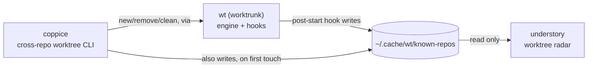
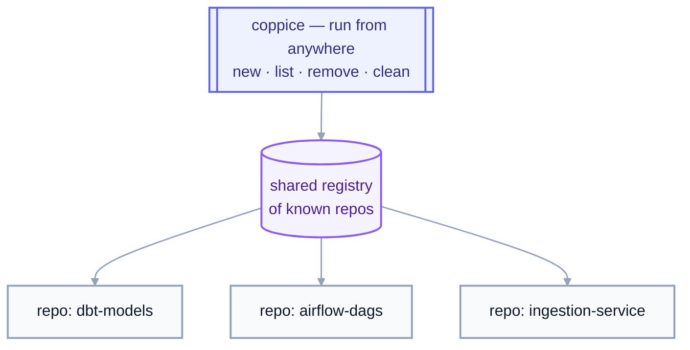
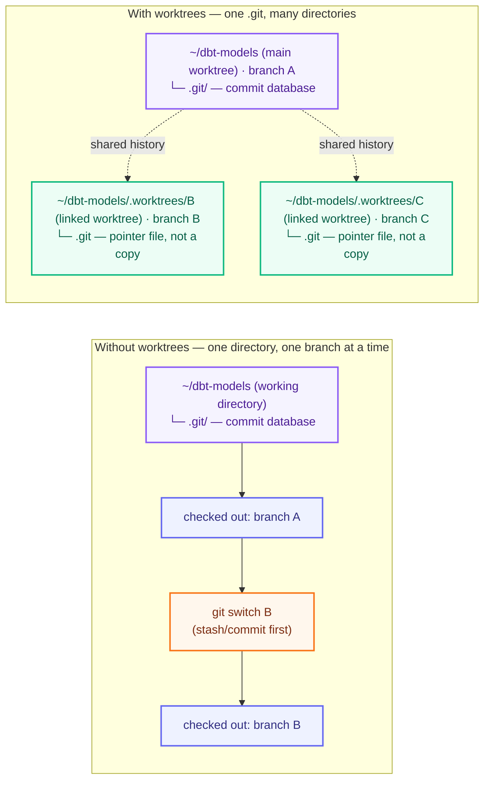

# coppice

[](https://github.com/luiul/coppice/actions/workflows/ci.yml)
[](LICENSE)

A path-based CLI for managing git worktrees across every repo on your
machine, from a single set of commands.

Built on top of [`wt`](https://worktrunk.dev) (worktrunk), which does the
actual worktree work: creating them, and running the hooks that turn a
bare checkout into a set-up dev environment. `coppice` adds what `wt`
doesn't: commands that reach across *all* your repos from *anywhere* on
disk.

## Ecosystem

coppice is one of four tools that split "what's running, and where, on
this machine" into two independent radars over two independent lifecycle
tools, one pair for git worktrees, one pair for agent sessions:

| Tool | Layer | Job |
|---|---|---|
| [`wt`](https://worktrunk.dev) (worktrunk) | engine | creates/removes worktrees, runs lifecycle hooks (`post-start`, `pre-remove`, ...), maintains the shared registry |
| **coppice** (this repo) | lifecycle CLI | cross-repo `new`/`list`/`remove`/`clean` worktrees, on top of `wt`, from anywhere on disk |
| [understory](https://github.com/luiul/understory) | worktree radar | live, read-only dashboard of every worktree in the registry; open-or-focus a VS Code window on Enter |
| [canopy](https://github.com/luiul/canopy) | agent radar | live, read-only dashboard of every agent CLI session on the machine; jump-to-window on Enter |



That shared registry (`~/.cache/wt/known-repos`, see [How the registry
works](#how-the-registry-works)) is the seam between the lifecycle side
(`wt`/coppice, which write it) and the radar side (understory, which only
reads it): coppice never has to know understory exists, and understory
never has to know how a worktree got created. canopy doesn't appear in
that diagram: it's fully independent of this registry and of the other
three tools here, discovering agent processes directly via `ps`/`lsof` and
AppleScript for Ghostty, rather than anything worktree-related. It's
included in the table above because the two dashboards (canopy, understory)
are meant to run side by side, each a single-view radar over one kind of
thing, agent sessions or worktrees, rather than one tool trying to cover
both.

## Why

Working on more than one thing in a repo usually means switching
branches one at a time: stash, checkout, work, stash again. That's
sequential even when the tasks aren't.

Git worktrees fix that: each branch gets its own directory, all sharing
the same `.git` history, so several branches can be checked out at once.
But `wt` (and raw `git worktree`) only operate on one repo, from inside
it.

**What `coppice` adds:** commands that create, list, and clean up
worktrees as one-liners, from anywhere on disk, across every repo
you've touched.

### Parallelize work in a single repo

Each worktree is a full, isolated checkout sharing the same `.git`
history, so a human and any number of agents can work on the same repo at
once, each in their own directory: one agent adding a column, another
fixing a DAG's schedule, you debugging a failing pipeline. No branch
switching, no blocking each other:


`cop new ~/dbt-models` (or a bare `cop ~/dbt-models`) spins up the next
worktree; once that work is done, `cop clean` sweeps up whichever ones
are merged and idle.

### Reach every repo, from anywhere

Juggling worktrees across several repos, your dbt project, your Airflow
DAGs, your ingestion jobs, makes it easy to lose track of what's checked
out where, and stale worktrees pile up unnoticed. `coppice` tracks every
repo it's touched in a shared registry, so `list`/`clean` sweep across
all of them, regardless of which one you're standing in:



The registry is what makes this possible: each command takes an explicit
**path**, or defaults to every repo it already knows about, instead of
relying on your current directory. `cop new ~/dbt-models` works the same
from `~/dbt-models`, `~/airflow-dags`, or your home directory.

### Automate everything that happens around a worktree

A plain `git worktree add` gets you an empty checkout: no `.venv`, no
editor window, no local `.env`. Closing that gap is `wt`'s job, and it's
the other big reason coppice builds on `wt` instead of shelling out to
raw git: `wt` runs user-defined **hooks**, shell commands fired at points
in a worktree's life (`post-start`, `pre-remove`, and more), scoped to
every repo or to one specific repo by URL. A `post-start` hook is what
turns `cop new` from an empty checkout into a ready one every time, and
it's also how coppice's own registry gets populated (see [How the
registry works](#how-the-registry-works)).

For real examples, see [my `wt`
config](https://github.com/luiul/dotfiles/blob/main/worktrunk/.config/worktrunk/config.toml):
`.venv` symlinking, copying gitignored config, opening an editor,
project-scoped `dbt deps`, and a `pre-remove` guard against removing
protected branches. Run `wt config create --project` to scaffold your
own; see the [worktrunk hooks docs](https://worktrunk.dev) for the full
reference.

## Concepts

- **Repo**: a git repository, identified by its root directory, where
  `.git` lives: the database of every commit and branch. `coppice` works
  across every repo on disk, not just the one you're standing in.
- **Commit**: a snapshot of the repo's files, plus a pointer to its
  parent commit(s). Every worktree of a repo shares the same commit
  history, so a commit made in one worktree is visible in every other
  worktree immediately.
- **Branch**: a named pointer to a commit, e.g. `add-customer-id-column`.
  Cheap: git can have many branches with none checked out anywhere.
  Without worktrees you work on one branch at a time in one directory,
  and switching (`git switch`/`git checkout`) requires committing or
  stashing first.
- **Worktree**: a separate directory on disk checked out to one branch,
  reading from the same `.git` database as every other worktree of that
  repo (details in [One `.git`, many working
  directories](#one-git-many-working-directories)). A worktree's identity
  is its directory, not its branch: git refuses to check out the same
  branch in two worktrees at once, so switching between worktrees is just
  changing directories, no stashing required.
- **Main worktree**: the original checkout, the one that actually holds
  `.git`, as opposed to a **linked** worktree's pointer file (see [One
  `.git`, many working directories](#one-git-many-working-directories)).
  It's the repo itself, not something `coppice` creates or manages
  alongside it, so `cop list`/`status` never count or list it as "a
  worktree"; its branch name shows up folded into the repo heading
  instead (e.g. `(main: master)`), and `remove`/`clean` always skip it.
- **Current worktree**: whichever one you happen to be standing in when
  you run a command, its branch shown in bold green in `cop list`.
- **Registry**: the shared list of repos `coppice`/`wt` have seen before
  (`~/.cache/wt/known-repos`), letting `cop list`/`remove`/`clean`
  operate across every repo you've touched.
- **Scope**: the set of repos a command like `list`/`remove`/`clean`
  operates over: an explicit path (or `--repo`) scopes to just that
  repo; omitting it defaults to every repo in the registry.

### One `.git`, many working directories

`.git` is a **directory holding a database**: every commit, branch, and
the history tying them together, stored in git's own object format
rather than plain files. It lives *inside* your working directory, e.g.
`~/dbt-models/.git`, alongside the files you actually edit.

A normal checkout has exactly one working directory with `.git` inside
it, so switching branches means mutating that same directory in place:
stash or commit, then `git switch`, over and over. A worktree adds
another working directory elsewhere on disk, but not its own copy of
`.git`; only the original directory (the **main worktree**) holds the
real database. Every other (**linked**) worktree just holds a small
`.git` *file* pointing back to it, so all of them read and write the
same history:



A worktree's identity is its directory, not its branch; the branch is
just what it's checked out to, set at creation (`cop new`/`git worktree
add`). Git enforces the constraint that makes this safe: the same branch
can never be checked out in two worktrees at once.

### Worktree status: dirty, merged, stale

Three states `cop list`/`cop clean` report on and act on differently:

- **Dirty**: the worktree has uncommitted changes (staged, modified,
  untracked, deleted, or renamed). `clean` always skips dirty worktrees;
  `remove` refuses them unless you pass `--force`/`-f`.
- **Merged**: the branch has been merged into the repo's default branch.
  `remove`/`clean` keep the branch by default unless it's merged, or
  `-D`/`--force-delete` is passed. It's also what `clean --merged` filters
  on, instead of age.
- **Stale (dangling)**: the worktree's directory is already gone from disk
  (removed outside `coppice`/`wt`) but git still has a record of it.
  `clean` always removes these, regardless of age or the `--merged` flag.

The Merge column in `cop list` (and `cop clean`'s preview labels) buckets
`wt`'s `main_state` into `merged` (nothing to integrate, safe to remove),
`unmerged` (has commits main doesn't, merges cleanly), `conflict` (has
commits main doesn't, and `wt`'s merge simulation says merging would
conflict), or `unknown` (`wt` can't relate the branch to main). Only the
`merged` bucket is removable via `clean --merged`; a `conflict` label is
an invitation to merge or rebase, never to delete.

### Branches vs. worktrees, in coppice's commands

coppice identifies things by **branch name**, since that's what you
think in, but what its commands actually create, list, or remove is
that branch's **worktree**, not the branch itself:

| Command | Takes | Does |
|---|---|---|
| `cop new PATH [--branch B] [--base REF] [--prompt TXT]` | a repo **path** | creates branch `B` if it doesn't exist yet, locally or on the remote (from `REF`, default: the repo's actual default branch, resolved fresh from its remote rather than trusting `wt`'s own cache), plus a worktree checked out onto it; if `B` already exists either way, asks before switching to it instead, unless `--yes`/`-y`. With `--prompt`, opens the worktree's VS Code window with `pi` already running `TXT` (setup in [`cop new --prompt`](#cop-new---prompt-start-pi-in-the-new-window)) |
| `cop list [PATH]` | nothing, or a repo path | lists worktrees, one per checked-out branch, **not** every branch in the repo, and **not** the main worktree (see [Concepts](#concepts)) |
| `cop remove BRANCH...` | one or more branch **names** | deletes each branch's worktree directory; the branch itself survives unless it's merged or `-D`/`--force-delete` is passed |
| `cop clean` | filters (age or `--merged`) | the bulk version of `remove`: same branch-vs-worktree distinction applies |

A branch with no worktree still exists; `git log`/`git checkout` see it
fine, it's just not checked out anywhere. It won't show up in `cop list`,
and there's nothing for `cop remove`/`cop clean` to act on.

## What it looks like

```console
$ cop new ~/dbt-models --branch add-customer-id-column
Worktree branch: add-customer-id-column

Created worktree for add-customer-id-column @ /Users/you/dbt-models/.worktrees/add-customer-id-column

$ cop list
Branch                      Created   Size    Working tree   Merge
━━━━━━━━━━━━━━━━━━━━━━━━━━━━━━━━━━━━━━━━━━━━━━━━━━━━━━━━━━━━━━━━━━━
airflow-dags (main: master)
  update-dag-schedule           1d    312M    clean          merged
  debug-failing-pipeline        1w    298M    dirty          unmerged

dbt-models (main: main)
  add-customer-id-column        2d    1.1G    clean          unmerged
  fix-ingestion-retry           5d    1.0G    clean          merged

4 worktrees in 2 repos · 2.7G on disk · 2 merged (cop clean --merged) · 1 dirty.
5 more repos with no extra worktrees (show with: cop list --all)

$ cop clean --dry-run
Scanning 2 repos for worktrees older than 14d...

airflow-dags (~/airflow-dags):
  rm       2w  backfill-2023-orders  (240M on disk, merged, branch will be deleted)

Scanned 2 repos, 5 worktrees: 1 removable, 0 dirty, 0 with an open PR, 4 under 14d old.
Total reclaimable: 240M across 1 worktree.
Dry run, nothing removed.
```

## Install

**Prerequisite:** [`wt`](https://worktrunk.dev) (worktrunk) must already be
installed and on `PATH`; `coppice` shells out to it for every worktree
operation. If it's missing, commands fail fast with a clear message. See
[worktrunk.dev](https://worktrunk.dev) for install instructions.

With the repo cloned, install it as a uv tool (editable, so local changes
take effect immediately):

```bash
uv tool install -e .
```

Then, so `cop new` can `cd` you into the worktree it creates, add shell
integration to your rc file:

```bash
# zsh (~/.zshrc) or bash (~/.bashrc)
eval "$(coppice shell init zsh)"   # or: bash
```

This defines `coppice` and its shorter alias `cop` as shell functions,
behaving identically; use whichever you prefer.

Two more tools are auto-detected, neither required:
[`fzf`](https://github.com/junegunn/fzf) powers `cop remove`'s interactive
picker, and [`gh`](https://cli.github.com) lets `cop clean` skip branches
with an open PR. Without them, those features just degrade gracefully.

## Usage

```bash
cop new ~/dbt-models                     # create branch + worktree for the repo at ~/dbt-models (or reuse it)
cop new .                                # ...for the repo you're standing in
cop new . --branch update-dag-schedule   # skip the prompt, use a specific branch name
cop new . --branch update-dag-schedule --yes   # skip the confirmation when the branch already exists
cop new . -p "fix the flaky login test"  # open the worktree's VS Code window with pi already running this prompt
cop list                                 # worktrees across every known repo (age, size, dirty/merge status)
cop list ~/dbt-models                    # ...just this one
cop list --all                           # ...also showing repos with no extra worktrees (hidden by default)
cop list --verbose                       # ...with a column for each worktree's on-disk path
cop list --no-size                       # skip the (directory-walking) size column, for a faster listing
cop list --json                          # same data, as JSON
cop remove add-customer-id-column        # remove a worktree by branch name (branch itself kept unless merged/-D)
cop remove a b --repo dbt-models --yes
cop remove                               # ...or omit the branch for an fzf multi-select picker
cop clean --dry-run                      # preview worktrees (not branches) older than 14 days, size + merge status
cop clean --yes                          # remove them (skips dirty worktrees and ones with an open PR)
cop clean --merged                       # sweep every worktree on a merged branch instead, regardless of age
cop clean 7 --repo dbt-models --merged   # ...scoped to one repo, merged only
cop status                               # is wt on PATH, table of the shared registry (worktree count, size, health)
```

Run `cop --help` or `cop <command> --help` for the full option list. A
bare `cop PATH` is shorthand for `cop new PATH`.

### Confirmation prompts

Every destructive (or merely surprising) action asks first, and every
prompt behaves the same way: one keypress, no enter needed.

- `y` confirms; `n`, `esc`, or `enter` cancel; any other key is ignored;
  `ctrl+c` quits. Prompts end in `[y/N]`: the capitalized letter is the
  default answer, so a bare enter cancels.
- The prompt text follows one template, `<Verb> <target>? <Consequence
  sentence>. [y/N]`, in yellow for an ordinary destructive action and red
  when a force flag (`--force`/`--force-delete`) is in play.
- `--yes`/`-y` skips the prompt entirely, for scripts.

Same discipline as the canopy/understory dashboards (see dashkit's
[CONVENTIONS.md](https://github.com/luiul/dashkit/blob/main/CONVENTIONS.md)),
except the 10s auto-cancel: that exists because a dashboard's rows keep
repolling under an open prompt, and a one-shot CLI prompt has nothing
moving underneath it.

### How the registry works

`list`/`remove`/`clean` operate over a registry of known repos
(`~/.cache/wt/known-repos`), not just your current directory. It's
populated automatically: by `wt`'s own `registry` post-start hook if
configured (see [Automate everything that happens around a
worktree](#automate-everything-that-happens-around-a-worktree)), or
otherwise by `coppice new` the first time it touches a repo. After that,
the repo stays visible to every command from anywhere on disk.

### `cop new --prompt`: start pi in the new window

`cop new . -p "fix the flaky login test"` hands the prompt to `wt`'s hooks
as `$COP_PROMPT`. With the hook below in your wt config, the worktree's new
VS Code window then opens with `pi` already running that prompt in its
integrated terminal, on create and on reuse of an existing worktree alike.
Without the hook the option is a silent no-op: `cop` only sets the variable.

The mechanics live entirely in wt's user config: a slim `post-switch` hook
calls [cop-prompt-deliver.sh](https://github.com/luiul/dotfiles/blob/main/worktrunk/.config/worktrunk/cop-prompt-deliver.sh)
(see it in context in [my wt
config](https://github.com/luiul/dotfiles/blob/main/worktrunk/.config/worktrunk/config.toml)),
which delivers the prompt two ways:

1. **Fast path (AppleScript, macOS)**: `code -n` opens (or focuses, on
   reuse) the worktree window; the script finds that window by its title
   (matching `<repo> — <branch>`, relying on the `window.title` setting
   `"${rootName} — ${activeRepositoryBranchName} — ${activeEditorShort}"`),
   opens a terminal pane via AppleScript menu commands, pastes `pi
   '<prompt>'` into it (via clipboard, safely restoring afterward), and hits
   Return. The prompt string is passed through a temp file to avoid
   multibyte corruption in AppleScript's env-var boundary crossing.
   Measured on this machine: `pi` starts ~1.5s after the window appears, vs
   ~3.2s waiting for the task system to start on a folderOpen task.
   Delivery is confirmed by waiting for a new `pi` process whose working
   directory is the worktree; anything less (failed window match, no
   Accessibility permission, VS Code not running) triggers the fallback.
2. **Fallback (folderOpen task)**: when the drive is impossible (no
   Accessibility permission, VS Code not running) or fails (focus lost to
   another window mid-drive, window title never matched), the script writes
   the prompt to `.cop-prompt` in the worktree, drops a self-cleaning
   `runOn: folderOpen` task into the worktree's `.vscode/tasks.json`
   (merging into the repo's own one when it exists and is plain JSON), and
   VS Code runs it in a terminal as the window loads: the task reads the
   prompt, deletes `.cop-prompt` (and the tasks.json too, when the script
   wrote it fresh), and starts `pi`. Reopening the folder later runs
   nothing.

A guard on the usual `post-start` window opener keeps create-with-prompt
from opening two windows, and the `copy-ignored` exclude keeps a stray
`.cop-prompt` in the main checkout from being reflinked over the one the
fallback just wrote:

```toml
[step.copy-ignored]
exclude = [".cop-prompt"]

[post-start]
vscode = '[ -n "$COP_PROMPT" ] || code -n {{ worktree_path }}'

[post-switch]
pi-prompt = '[ -n "$COP_PROMPT" ] && "$HOME/.config/worktrunk/cop-prompt-deliver.sh" "{{ worktree_path }}" "{{ repo }}" "{{ branch }}"'
```

One-time setup, per delivery path:

- Fast path: Accessibility permission for Terminal (System Settings >
  Privacy & Security > Accessibility > Terminal.app). The script drives
  VS Code's menu bar via AppleScript and pastes the prompt via the system
  clipboard (which it saves and restores).
- Fallback: `"task.allowAutomaticTasks": "on"` in the user settings (or
  click Allow on the one-time prompt the first folder-open task triggers,
  which sets the same thing), and the worktree directory trusted; VS Code
  runs no tasks at all in untrusted workspaces.
- Both: `pi` on `PATH` for the integrated terminal.

`cop` runs a non-blocking preflight on every `--prompt` invocation and prints
a dim warning when `pi` or the VS Code setting is missing, or when the repo
already has a `.vscode/tasks.json` the fallback will merge into.

### Shell integration, in more detail

`coppice`/`cop` is a plain executable, not a shell function, so it can't
change your shell's working directory on its own: a subprocess's `cd`
never outlives the subprocess. (`wt` has the same problem, and solves it
the same way, via `wt config shell install`.)

`coppice shell init <zsh|bash>` prints wrapper functions that run the real
binary with an env var pointing at a temp file, then `cd` there if `new`
wrote a path into it (only `new` does, and only on success). Without the
wrapper, `new` still works, it just prints the path instead of moving you
there:

```bash
cd "$(cop new . --branch update-dag-schedule | sed -n 's/.* @ //p' | tail -1)"
```

## Status

Early days. `new`, `list`, `remove` (with an interactive `fzf` picker),
`clean`, `status`, and shell integration cover the daily loop. See [open
issues](https://github.com/luiul/coppice/issues) for what's not there yet.

## Development

```bash
uv sync --group dev
uv run pytest
uv run ruff check .
uv run ty check
```

## License

MIT, see [LICENSE](LICENSE).
