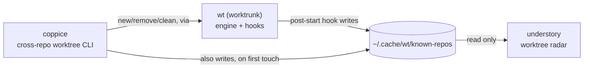
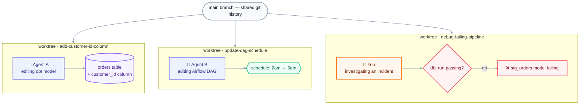
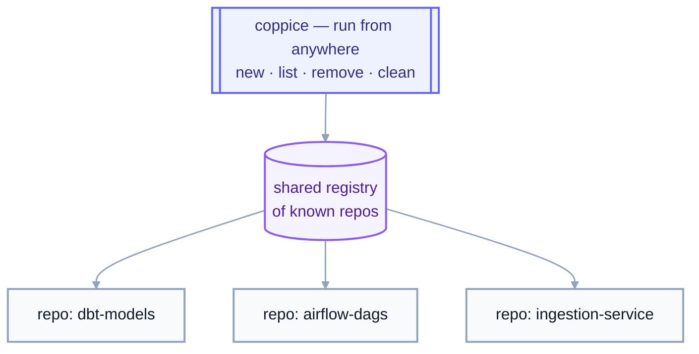
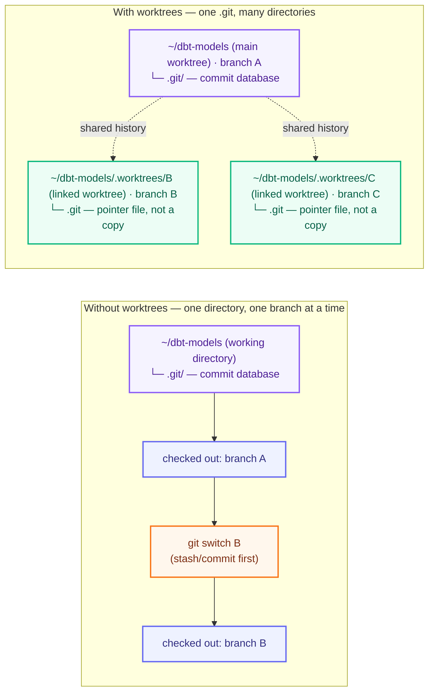
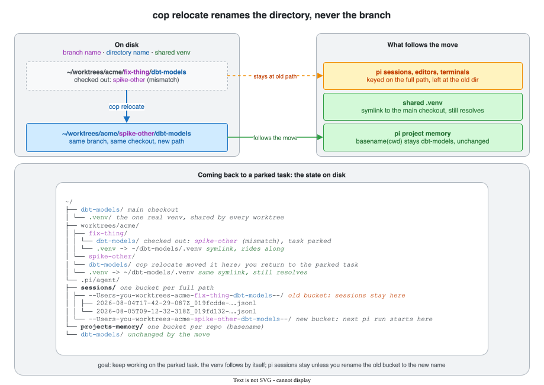

# coppice

[](https://github.com/luiul/coppice/actions/workflows/ci.yml)
[](LICENSE)

A path-based CLI for managing git worktrees across every repo on your
machine, from a single set of commands.

Built on top of [`wt`](https://worktrunk.dev) (worktrunk), which does the
actual worktree work: creating them, and running the hooks that turn a
bare checkout into a set-up dev environment. `coppice` adds what `wt`
doesn't: commands that reach across *all* your repos from *anywhere* on
disk.

## Ecosystem

coppice is one of four tools that split "what's running, and where, on
this machine" into two independent radars over two independent lifecycle
tools, one pair for git worktrees, one pair for agent sessions:

| Tool | Layer | Job |
|---|---|---|
| [`wt`](https://worktrunk.dev) (worktrunk) | engine | creates/removes worktrees, runs lifecycle hooks (`post-start`, `pre-remove`, ...), maintains the shared registry |
| **coppice** (this repo) | lifecycle CLI | cross-repo `new`/`list`/`remove`/`clean` worktrees, on top of `wt`, from anywhere on disk |
| [understory](https://github.com/luiul/understory) | worktree radar | live, read-only dashboard of every worktree in the registry; open-or-focus a VS Code window on Enter |
| [canopy](https://github.com/luiul/canopy) | agent radar | live, read-only dashboard of every agent CLI session on the machine; jump-to-window on Enter |



That shared registry (`~/.cache/wt/known-repos`, see [How the registry
works](#how-the-registry-works)) is the seam between the lifecycle side
(`wt`/coppice, which write it) and the radar side (understory, which only
reads it): coppice never has to know understory exists, and understory
never has to know how a worktree got created. canopy doesn't appear in
that diagram: it's fully independent of this registry and of the other
three tools here, discovering agent processes directly via `ps`/`lsof` and
AppleScript for Ghostty, rather than anything worktree-related. It's
included in the table above because the two dashboards (canopy, understory)
are meant to run side by side, each a single-view radar over one kind of
thing, agent sessions or worktrees, rather than one tool trying to cover
both.

## Why

Working on more than one thing in a repo usually means switching
branches one at a time: stash, checkout, work, stash again. That's
sequential even when the tasks aren't.

Git worktrees fix that: each branch gets its own directory, all sharing
the same `.git` history, so several branches can be checked out at once.
But `wt` (and raw `git worktree`) only operate on one repo, from inside
it.

**What `coppice` adds:** commands that create, list, and clean up
worktrees as one-liners, from anywhere on disk, across every repo
you've touched.

### Parallelize work in a single repo

Each worktree is a full, isolated checkout sharing the same `.git`
history, so a human and any number of agents can work on the same repo at
once, each in their own directory: one agent adding a column, another
fixing a DAG's schedule, you debugging a failing pipeline. No branch
switching, no blocking each other:



`cop new ~/dbt-models` (or a bare `cop ~/dbt-models`) spins up the next
worktree; once that work is done, `cop clean` sweeps up whichever ones
are merged and idle.

### Reach every repo, from anywhere

Juggling worktrees across several repos, your dbt project, your Airflow
DAGs, your ingestion jobs, makes it easy to lose track of what's checked
out where, and stale worktrees pile up unnoticed. `coppice` tracks every
repo it's touched in a shared registry, so `list`/`clean` sweep across
all of them, regardless of which one you're standing in:



The registry is what makes this possible: each command takes an explicit
**path**, or defaults to every repo it already knows about, instead of
relying on your current directory. `cop new ~/dbt-models` works the same
from `~/dbt-models`, `~/airflow-dags`, or your home directory.

### Automate everything that happens around a worktree

A plain `git worktree add` gets you an empty checkout: no `.venv`, no
editor window, no local `.env`. Closing that gap is `wt`'s job, and it's
the other big reason coppice builds on `wt` instead of shelling out to
raw git: `wt` runs user-defined **hooks**, shell commands fired at points
in a worktree's life (`post-start`, `pre-remove`, and more), scoped to
every repo or to one specific repo by URL. A `post-start` hook is what
turns `cop new` from an empty checkout into a ready one every time, and
it's also how coppice's own registry gets populated (see [How the
registry works](#how-the-registry-works)).

For real examples, see [my `wt`
config](https://github.com/luiul/dotfiles/blob/main/worktrunk/.config/worktrunk/config.toml):
`.venv` symlinking, copying gitignored config, opening an editor,
project-scoped `dbt deps`, and a `pre-remove` guard against removing
protected branches. Run `wt config create --project` to scaffold your
own; see the [worktrunk hooks docs](https://worktrunk.dev) for the full
reference.

## Concepts

- **Repo**: a git repository, identified by its root directory, where
  `.git` lives: the database of every commit and branch. `coppice` works
  across every repo on disk, not just the one you're standing in.
- **Commit**: a snapshot of the repo's files, plus a pointer to its
  parent commit(s). Every worktree of a repo shares the same commit
  history, so a commit made in one worktree is visible in every other
  worktree immediately.
- **Branch**: a named pointer to a commit, e.g. `add-customer-id-column`.
  Cheap: git can have many branches with none checked out anywhere.
  Without worktrees you work on one branch at a time in one directory,
  and switching (`git switch`/`git checkout`) requires committing or
  stashing first.
- **Worktree**: a separate directory on disk checked out to one branch,
  reading from the same `.git` database as every other worktree of that
  repo (details in [One `.git`, many working
  directories](#one-git-many-working-directories)). A worktree's identity
  is its directory, not its branch: git refuses to check out the same
  branch in two worktrees at once, so switching between worktrees is just
  changing directories, no stashing required.
- **Main worktree**: the original checkout, the one that actually holds
  `.git`, as opposed to a **linked** worktree's pointer file (see [One
  `.git`, many working directories](#one-git-many-working-directories)).
  It's the repo itself, not something `coppice` creates or manages
  alongside it, so `cop list`/`status` never count or list it as "a
  worktree"; its branch name shows up folded into the repo heading
  instead (e.g. `(main: master)`), and `remove`/`clean` always skip it.
- **Current worktree**: whichever one you happen to be standing in when
  you run a command, its branch shown in bold green in `cop list`.
- **Registry**: the shared list of repos `coppice`/`wt` have seen before
  (`~/.cache/wt/known-repos`), letting `cop list`/`remove`/`clean`
  operate across every repo you've touched.
- **Scope**: the set of repos a command like `list`/`remove`/`clean`
  operates over: an explicit path (or `--repo`) scopes to just that
  repo; omitting it defaults to every repo in the registry.

### One `.git`, many working directories

`.git` is a **directory holding a database**: every commit, branch, and
the history tying them together, stored in git's own object format
rather than plain files. It lives *inside* your working directory, e.g.
`~/dbt-models/.git`, alongside the files you actually edit.

A normal checkout has exactly one working directory with `.git` inside
it, so switching branches means mutating that same directory in place:
stash or commit, then `git switch`, over and over. A worktree adds
another working directory elsewhere on disk, but not its own copy of
`.git`; only the original directory (the **main worktree**) holds the
real database. Every other (**linked**) worktree just holds a small
`.git` *file* pointing back to it, so all of them read and write the
same history:



A worktree's identity is its directory, not its branch; the branch is
just what it's checked out to, set at creation (`cop new`/`git worktree
add`). Git enforces the constraint that makes this safe: the same branch
can never be checked out in two worktrees at once.

### Worktree status: dirty, merged, stale

Three states `cop list`/`cop clean` report on and act on differently:

- **Dirty**: the worktree has uncommitted changes (staged, modified,
  untracked, deleted, or renamed). `clean` always skips dirty worktrees;
  `remove` refuses them unless you pass `--force`/`-f`.
- **Merged**: the branch has been merged into the repo's default branch.
  `remove`/`clean` keep the branch by default unless it's merged, or
  `-D`/`--force-delete` is passed. It's also what `clean --merged` filters
  on, instead of age.
- **Stale (dangling)**: the worktree's directory is already gone from disk
  (removed outside `coppice`/`wt`) but git still has a record of it.
  `clean` always removes these, regardless of age or the `--merged` flag.

There's also a fourth, opt-in state: **parked** (`cop park`), for a
worktree whose task is complete but which stays on disk in case follow-up
arrives (review comments, QA, a hotfix). The states above are git state;
parked is *task* state. The mark is a `branch.<branch>.parked-at`
timestamp in the repo's git config: it dies with the branch (so `remove`
cleans it up) and never dirties the worktree. Parked worktrees render
dimmed in `cop list` with a blue `parked Nd` label and sort after live ones,
`cop sync` skips them (nothing to merge into a task-complete tree), and
`cop remove` and `cop clean` refuse them: a parked worktree is kept for
follow-up, so removing one needs a `cop unpark` first. The sweep path for
parked worktrees is `cop clean --parked`, which removes the ones parked a
week or more ago. The mark
means "nothing new since I marked it": if the branch head moves after the
mark, the worktree reads as active again with a `follow-up` note in
`cop list`, no cleanup job needed. Follow-up arrived? `cop unpark`, then
sync.

The Merge column in `cop list` (and `cop clean`'s preview labels) buckets
`wt`'s `main_state` into `merged` (nothing to integrate, safe to remove),
`unmerged` (has commits main doesn't, merges cleanly), `conflict` (has
commits main doesn't, and `wt`'s merge simulation says merging would
conflict), or `unknown` (`wt` can't relate the branch to main). Only the
`merged` bucket is removable via `clean --merged`; a `conflict` label is
an invitation to merge or rebase, never to delete.

### Keeping worktrees current: `cop sync`

A worktree you come back to days later has fallen behind its base branch.
`cop sync` fixes that in one pass: it fetches each repo's base remote
(`origin/<default branch>`, resolved fresh from the remote, or `--base`),
fast-forwards the main worktree's own checkout of the base branch when
it's clean (`--no-main` skips that), then merges the base into every
managed worktree. Dirty worktrees, stale references, and detached HEADs
are skipped; worktrees whose merge *would* conflict are predicted with
`git merge-tree` and left untouched, reported as conflicts, so a worktree
is never left half-merged. `--dry-run` previews all of it accurately,
since the classification is pure plumbing. Every run closes with a `Needs
attention` extract listing the worktrees that did not sync correctly
(conflicts, warning-tier skips, errors, stale references), grouped by
repo, so a long run's action items don't scroll away above the summary
line.

Because sync merges (rather than rebases or squash-merges), the merge base
advances with every run: each conflict is resolved exactly once, pushed
branches never need force-pushing, and `wt`'s `main_state` moves from
`diverged` back to `ahead` once a worktree is current. The merge commits
collapse at landing time anyway, since `wt merge` squashes the branch.

### Branches vs. worktrees, in coppice's commands

coppice identifies things by **branch name**, since that's what you
think in, but what its commands actually create, list, or remove is
that branch's **worktree**, not the branch itself:

| Command | Takes | Does |
|---|---|---|
| `cop new PATH [--branch B] [--base REF]` | a repo **path** | creates branch `B` if it doesn't exist yet, locally or on the remote (from `REF`, default: the repo's actual default branch, resolved fresh from its remote rather than trusting `wt`'s own cache; an explicit `REF` is fetched from its remote first, best-effort, since `wt` forks from the remote-tracking ref as it stands locally), plus a worktree checked out onto it; if `B` already exists either way, asks before switching to it instead, unless `--yes`/`-y`; if `B`'s worktree path is occupied by a worktree checked out on another branch (a directory created for `B` earlier, later `git switch`ed away by hand), offers a fix and retries: switch the occupier back to `B` in place (the default remedy, `s`: the directory stays put, the occupier's commits stay on its branch), or, when `wt` can move the occupier, relocate it to its own expected path (explicit `r` only: a fresh `B` worktree then takes over the old path, and tools attached to the old path, pi sessions, editors, terminals, keep pointing at it); never moves or creates directories when stdin isn't a terminal |
| `cop list [PATH]` | nothing, or a repo path | lists worktrees, one per checked-out branch, **not** every branch in the repo, and **not** the main worktree (see [Concepts](#concepts)); a worktree sitting at another branch's path (see the `cop new` remedy) is flagged ` @ <that-branch>/` next to its checked-out branch |
| `cop sync [BRANCH...]` | nothing, or branch **names** | merges the repo's base remote into each branch's worktree (all of them by default), keeping long-lived worktrees current |
| `cop relocate [PATH]` | nothing, or a repo path | moves each mismatched worktree (a directory created for one branch, later `git switch`ed to another, so the path and the checkout disagree) back to the path the worktree-path template assigns its branch, after a preview and confirmation; every move is computed by `wt step relocate`, never by a local copy of the template |
| `cop remove BRANCH...` | one or more branch **names** | deletes each branch's worktree directory; the branch itself survives unless it's merged or `-D`/`--force-delete` is passed |
| `cop clean` | filters (age or `--merged`) | the bulk version of `remove`: same branch-vs-worktree distinction applies |

A branch with no worktree still exists; `git log`/`git checkout` see it
fine, it's just not checked out anywhere. It won't show up in `cop list`,
and there's nothing for `cop remove`/`cop clean` to act on.

### What `cop relocate` moves: the directory, never the branch

`cop relocate` heals a mismatch by renaming the directory on disk. The
branch is not touched: same name, same commits, still checked out when
the move finishes. Say `cop new ~/dbt-models --branch fix-thing`
created a worktree for the new branch `fix-thing`. With the template
`~/worktrees/{{ owner }}/{{ branch }}/{{ repo }}` its directory is
`~/worktrees/acme/fix-thing/dbt-models`: owner `acme`, the branch name
`fix-thing` as the parent segment, and the worktree directory itself
named after the repo, `dbt-models`. Someone later runs
`git switch spike-other` inside it, works there for a while, then
parks the task with `cop park` and moves on. The path's branch
segment still says `fix-thing` while the checkout serves the branch
`spike-other`,
so `cop list` flags the row as `spike-other @ fix-thing/`: the row's
branch is the checked-out one, and the `@ .../` part is the parent
directory's name. The relocate moves the directory to
`~/worktrees/acme/spike-other/dbt-models`, the path the worktree-path
template assigns the branch actually checked out there, and updates
git's worktree metadata to match. Branch segment and branch agree
again; the directory name stays `dbt-models` throughout.



What else follows the move depends on how a tool keys its state:

- **The shared `.venv`** follows by itself. There is one real venv
  per repo, in the main checkout; every worktree gets a `.venv`
  symlink to it at creation (a venv's absolute paths can't be copied,
  only shared or rebuilt). The symlink rides along inside the moved
  directory, and its target never moves, so the environment keeps
  working with nothing to reinstall. Only a shell that already
  activated it points at the old path: re-activate from the new one.
- **Git** is not path-keyed at all: branches, refs, and the checkout
  are unaffected, and so is the `cop park` mark (a git config value
  keyed by repo and branch).
- **pi's project memory and skills** key on `basename(cwd)`. That is
  why the example template ends in the repo name: every worktree of a
  repo lands in the same bucket as the main checkout, and a relocate
  only changes the branch segment in the middle, so the bucket name
  survives unchanged. A template ending in the branch segment would
  orphan the bucket on every relocate.
- **pi's sessions** key on the full directory path. They stay behind
  under the old path, still listed in the picker's global view. The
  mechanics and the remedy are below.
- **Editors and terminals** key on the path too: reopen them at the
  new location.

The goal for a parked task: weeks later you come back and keep
working, and the piece that matters most is the environment, since a
rebuilt venv is the expensive part. It survives the move on its own,
as shown above. pi sessions are the one thing left behind. Each
session is one file, `<timestamp>_<id>.jsonl`, in a bucket directory
under `~/.pi/agent/sessions/`. The bucket name is the working
directory, encoded: drop the leading slash, turn the remaining
slashes into dashes, and wrap the result in `--`. Project memory uses
a second, coarser key: `basename(cwd)`, so its bucket is just the
repo name. On disk, before and after the move:

```text
~/
├── dbt-models/  main checkout
│   └── .venv/   the one real venv, shared by every worktree
├── worktrees/acme/
│   ├── fix-thing/
│   │   └── dbt-models/  checked out: spike-other (mismatch), task parked
│   │       └── .venv -> ~/dbt-models/.venv  symlink, rides along
│   └── spike-other/
│       └── dbt-models/  cop relocate moved it here; you return to the parked task
│           └── .venv -> ~/dbt-models/.venv  same symlink, still resolves
└── .pi/agent/
    ├── sessions/  one bucket per full path
    │   ├── --Users-you-worktrees-acme-fix-thing-dbt-models--/    old bucket: sessions stay here
    │   │   ├── 2026-08-04T17-42-29-087Z_019fcdde-….jsonl
    │   │   └── 2026-08-05T09-12-32-318Z_019fd132-….jsonl
    │   └── --Users-you-worktrees-acme-spike-other-dbt-models--/  new bucket: next pi run starts here
    └── projects-memory/  one bucket per repo (basename)
        └── dbt-models/   unchanged by the move
```

`pi --continue` opens the most recent file in the current directory's
bucket, and the `--resume` picker lists that bucket (it can also show
every bucket). The relocate changed the working directory, so your
next `pi` run computes a fresh bucket and the parked sessions no
longer show up locally. They remain visible in the picker's global
view; rename the old bucket to the new encoded path and `--continue`
picks them up again. With a custom `sessionDir` pi also checks the
recorded cwd, so update each moved file's first line too.

## What it looks like

```console
$ cop new ~/dbt-models --branch add-customer-id-column
Worktree branch: add-customer-id-column

Created worktree for add-customer-id-column @ /Users/you/dbt-models/.worktrees/add-customer-id-column

$ cop list
Branch                      Created   Size    Working tree   Merge
━━━━━━━━━━━━━━━━━━━━━━━━━━━━━━━━━━━━━━━━━━━━━━━━━━━━━━━━━━━━━━━━━━━
airflow-dags (main: master)
  update-dag-schedule           1d    312M    clean          merged
  debug-failing-pipeline        1w    298M    dirty          unmerged

dbt-models (main: main)
  add-customer-id-column        2d    1.1G    clean          unmerged
  fix-ingestion-retry           5d    1.0G    clean          merged

4 worktrees in 2 repos · 2.7G on disk · 2 merged (cop clean --merged) · 1 dirty.
5 more repos with no extra worktrees (show with: cop list --all)

$ cop clean --dry-run
Scanning 2 repos for worktrees older than 14d...

airflow-dags (~/airflow-dags):
  rm       2w  backfill-2023-orders  (240M on disk, merged, branch will be deleted)

Scanned 2 repos, 5 worktrees: 1 removable, 0 dirty, 0 with an open PR, 4 under 14d old.
Total reclaimable: 240M across 1 worktree.
Dry run, nothing removed.

$ cop sync
Worktree                     Result     Detail
━━━━━━━━━━━━━━━━━━━━━━━━━━━━━━━━━━━━━━━━━━━━━━━━━━━━━━━━━━━━━━━━━━━━━━━
dbt-models (base: origin/main)
  main worktree              ff         2 commits from origin/main
  add-customer-id-column     synced     2 commits from origin/main
  fix-ingestion-retry        conflict   would conflict; left untouched
  debug-pipeline             skip       uncommitted changes

Synced 1 worktree, fast-forwarded 1 main checkout, 1 skipped, 1 conflict.
```

## Install

**Prerequisite:** [`wt`](https://worktrunk.dev) (worktrunk) must already be
installed and on `PATH`; `coppice` shells out to it for every worktree
operation. If it's missing, commands fail fast with a clear message. See
[worktrunk.dev](https://worktrunk.dev) for install instructions.

With the repo cloned, install it as a uv tool (editable, so local changes
take effect immediately):

```bash
uv tool install -e .
```

Then, so `cop new` can `cd` you into the worktree it creates, add shell
integration to your rc file:

```bash
# zsh (~/.zshrc) or bash (~/.bashrc)
eval "$(coppice shell init zsh)"   # or: bash
```

This defines `coppice` and its shorter alias `cop` as shell functions,
behaving identically; use whichever you prefer.

Two more tools are auto-detected, neither required:
[`fzf`](https://github.com/junegunn/fzf) powers `cop remove`'s interactive
picker, and [`gh`](https://cli.github.com) lets `cop clean` skip branches
with an open PR. Without them, those features just degrade gracefully.

## Usage

```bash
cop new ~/dbt-models                     # create branch + worktree for the repo at ~/dbt-models (or reuse it)
cop new .                                # ...for the repo you're standing in
cop new . --branch update-dag-schedule   # skip the prompt, use a specific branch name
cop new . --branch update-dag-schedule --yes   # skip the confirmation when the branch already exists
cop sync                                 # fetch each repo's base remote and merge it into every worktree
cop sync --dry-run                       # preview what would be merged, changing nothing
cop sync feat-a feat-b                   # ...just these branches' worktrees
cop sync --repo ~/dbt-models             # ...scoped to one repo
cop sync --no-main                       # leave the main worktree's own checkout of the base branch alone
cop park                                 # mark the current worktree's branch parked (task complete, kept for follow-up)
cop park feat-a feat-b                   # ...or park by branch name (a worktree's directory name works too)
cop unpark feat-a                         # follow-up arrived: back to active (sync merges into it again)
cop relocate                             # move mismatched worktrees (flagged '@ other-dir/' in cop list) back to their template paths
cop relocate --dry-run                   # ...preview the moves, changing nothing
cop relocate ~/dbt-models                # ...scoped to one repo
cop list                                 # worktrees across every known repo (age, size, dirty/merge status)
cop list ~/dbt-models                    # ...just this one
cop list --all                           # ...also showing repos with no extra worktrees (hidden by default)
cop list --verbose                       # ...with a column for each worktree's on-disk path
cop list --no-size                       # skip the (directory-walking) size column, for a faster listing
cop list --json                          # same data, as JSON
cop remove add-customer-id-column        # remove a worktree by branch name (branch kept unless merged/-D; parked worktrees are refused: cop unpark first)
cop remove a b --repo dbt-models --yes
cop remove                               # ...or omit the branch for an fzf multi-select picker
cop clean --dry-run                      # preview worktrees (not branches) older than 14 days, size + merge status
cop clean --yes                          # remove them (skips dirty, parked, and open-PR worktrees)
cop clean --merged                       # sweep every worktree on a merged branch instead, regardless of age
cop clean --parked                       # sweep worktrees parked 7+ days ago (same dirty/open-PR safety rails)
cop clean 3 --parked --dry-run           # preview worktrees parked 3+ days ago
cop clean 7 --repo dbt-models --merged   # ...scoped to one repo, merged only
cop status                               # is wt on PATH, table of the shared registry (worktree count, size, health)
```

Run `cop --help` or `cop <command> --help` for the full option list. A
bare `cop PATH` is shorthand for `cop new PATH`.

### Confirmation prompts

Every destructive (or merely surprising) action asks first, and every
prompt behaves the same way: one keypress, no enter needed.

- `y` confirms; `n`, `esc`, or `enter` cancel; any other key is ignored;
  `ctrl+c` quits. Prompts end in `[y/N]`: the capitalized letter is the
  default answer, so a bare enter cancels.
- The prompt text follows one template, `<Verb> <target>? <Consequence
  sentence>. [y/N]`, in yellow for an ordinary destructive action and red
  when a force flag (`--force`/`--force-delete`) is in play.
- `--yes`/`-y` skips the prompt entirely, for scripts.
- When a worktree about to be removed has a VS Code window open on it,
  `remove` and `clean` mark its line with `(VS Code window open)` and
  suggest closing it first: deleting the directory out from under the
  window strands it. Detection lists the window titles (one System
  Events osascript call; the dotfiles `window.title` setting renders
  each title as the opened folder's full path, branch never matched)
  and matches exact folder paths, so same-named worktrees and phantom
  branches can't warn wrongly. A failed listing, or an empty one while
  Code runs (macOS culls the accessibility tree of a backgrounded
  app), stays silent rather than ever claiming "not open".

Same discipline as the canopy/understory dashboards (see dashkit's
[CONVENTIONS.md](https://github.com/luiul/dashkit/blob/main/CONVENTIONS.md)),
except the 10s auto-cancel: that exists because a dashboard's rows keep
repolling under an open prompt, and a one-shot CLI prompt has nothing
moving underneath it.

### How the registry works

`list`/`remove`/`clean` operate over a registry of known repos
(`~/.cache/wt/known-repos`), not just your current directory. It's
populated automatically: by `wt`'s own `registry` post-start hook if
configured (see [Automate everything that happens around a
worktree](#automate-everything-that-happens-around-a-worktree)), or
otherwise by `coppice new` the first time it touches a repo. After that,
the repo stays visible to every command from anywhere on disk.

### Shell integration, in more detail

`coppice`/`cop` is a plain executable, not a shell function, so it can't
change your shell's working directory on its own: a subprocess's `cd`
never outlives the subprocess. (`wt` has the same problem, and solves it
the same way, via `wt config shell install`.)

`coppice shell init <zsh|bash>` prints wrapper functions that run the real
binary with an env var pointing at a temp file, then `cd` there if `new`
wrote a path into it (only `new` does, and only on success). Without the
wrapper, `new` still works, it just prints the path instead of moving you
there:

```bash
cd "$(cop new . --branch update-dag-schedule | sed -n 's/.* @ //p' | tail -1)"
```

## Status

Early days. `new`, `list`, `remove` (with an interactive `fzf` picker),
`clean`, `status`, and shell integration cover the daily loop. See [open
issues](https://github.com/luiul/coppice/issues) for what's not there yet.

## Development

```bash
uv sync --group dev
uv run pytest
uv run ruff check .
uv run ty check
```

## License

MIT, see [LICENSE](LICENSE).
