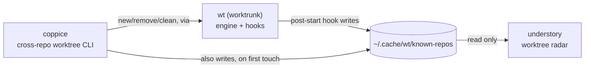

# Ecosystem

coppice is one of four tools that split "what's running, and where, on
this machine" into two independent radars over two independent lifecycle
tools, one pair for git worktrees, one pair for agent sessions:

| Tool | Layer | Job |
|---|---|---|
| [`wt`](https://worktrunk.dev) (worktrunk) | engine | creates/removes worktrees, runs lifecycle hooks (`post-start`, `pre-remove`, ...), maintains the shared registry |
| **coppice** (this repo) | lifecycle CLI | cross-repo `new`/`list`/`remove`/`clean` worktrees, on top of `wt`, from anywhere on disk |
| [understory](https://github.com/luiul/understory) | worktree radar | live, read-only dashboard of every worktree in the registry; open-or-focus a VS Code window on Enter |
| [canopy](https://github.com/luiul/canopy) | agent radar | live, read-only dashboard of every agent CLI session on the machine; jump-to-window on Enter |

That shared registry (`~/.cache/wt/known-repos`, see [How the registry
works](commands.md#how-the-registry-works)) is the seam between the
lifecycle side (`wt`/coppice, which write it) and the radar side
(understory, which only reads it): coppice never has to know understory
exists, and understory never has to know how a worktree got created.
canopy doesn't appear in that diagram: it's fully independent of this
registry and of the other three tools here, discovering agent processes
directly via `ps`/`lsof` and AppleScript for Ghostty, rather than
anything worktree-related. It's included in the table above because the
two dashboards (canopy, understory) are meant to run side by side, each
a single-view radar over one kind of thing, agent sessions or
worktrees, rather than one tool trying to cover both.
