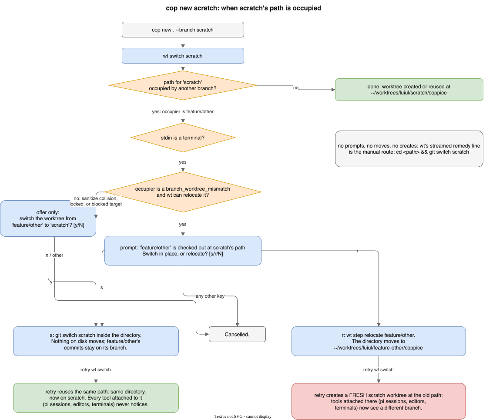

# Occupied-path recovery

`cop new scratch` asks `wt` for a worktree at `scratch`'s expected path.
Sometimes that path is already held by a worktree whose checkout is a
different branch, typically a directory created for `scratch` earlier
that someone `git switch`ed away by hand (a mismatch; see
[Concepts](../README.md#concepts)). Instead of failing, `cop new`
recovers interactively and retries.

The default remedy is **switch in place** (`s`): run `git switch
scratch` inside the existing directory. Nothing on disk moves, the
occupier's commits stay on their own branch, and every tool attached to
the path (pi sessions, editor windows, terminals) keeps working without
noticing.

The alternative is **relocate** (`r`, explicit only): move the occupier
to its own expected path, then let a fresh `scratch` worktree take over
the old one. This breaks every path-keyed attachment, and tools still
pointing at the old path silently see a different branch afterwards.

Any other key cancels the whole command.

Two guards keep this safe:

- Relocate is only offered when the occupier is a mismatch and `wt` can
  actually move it (not locked, no sanitize collision). Otherwise the
  prompt offers switch in place alone.
- When stdin is not a terminal (pipes, agent hooks), coppice never
  prompts, moves, or creates anything. The streamed `wt` error with its
  manual remedy line (`cd <path> && git switch <branch>`) is what you
  get.

The full decision flow:

Background and the incident that motivated the default:
[issue #27](https://github.com/luiul/coppice/issues/27). To fix an
existing mismatch outside `cop new`, use
[`cop relocate`](worktrees.md#what-cop-relocate-moves-the-directory-never-the-branch).
