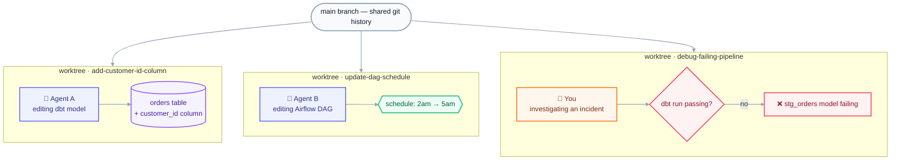
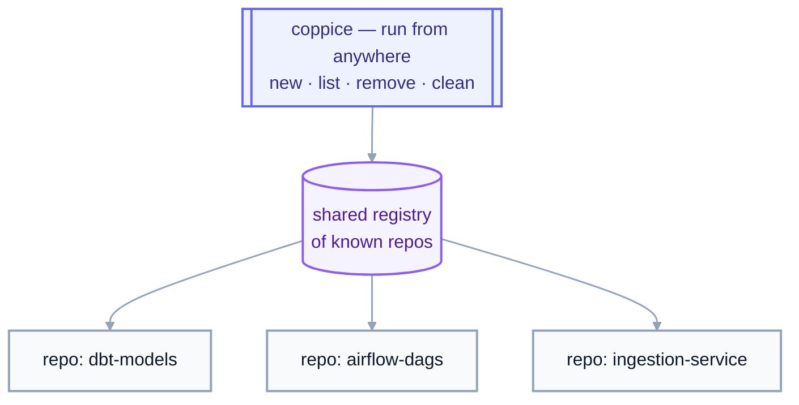

# Why worktrees, and why coppice

Working on more than one thing in a repo usually means switching
branches one at a time: stash, checkout, work, stash again. That's
sequential even when the tasks aren't.

Git worktrees fix that: each branch gets its own directory, all sharing
the same `.git` history, so several branches can be checked out at once.
But `wt` (and raw `git worktree`) only operate on one repo, from inside
it.

**What `coppice` adds:** commands that create, list, and clean up
worktrees as one-liners, from anywhere on disk, across every repo
you've touched.

## Parallelize work in a single repo

Each worktree is a full, isolated checkout sharing the same `.git`
history, so a human and any number of agents can work on the same repo at
once, each in their own directory: one agent adding a column, another
fixing a DAG's schedule, you debugging a failing pipeline. No branch
switching, no blocking each other:

`cop new ~/dbt-models` (or a bare `cop ~/dbt-models`) spins up the next
worktree; once that work is done, `cop clean` sweeps up whichever ones
are merged and idle.

## Reach every repo, from anywhere

Juggling worktrees across several repos, your dbt project, your Airflow
DAGs, your ingestion jobs, makes it easy to lose track of what's checked
out where, and stale worktrees pile up unnoticed. `coppice` tracks every
repo it's touched in a shared registry, so `list`/`clean` sweep across
all of them, regardless of which one you're standing in:

The registry is what makes this possible: each command takes an explicit
**path**, or defaults to every repo it already knows about, instead of
relying on your current directory. `cop new ~/dbt-models` works the same
from `~/dbt-models`, `~/airflow-dags`, or your home directory.

## Automate everything that happens around a worktree

A plain `git worktree add` gets you an empty checkout: no `.venv`, no
editor window, no local `.env`. Closing that gap is `wt`'s job, and it's
the other big reason coppice builds on `wt` instead of shelling out to
raw git: `wt` runs user-defined **hooks**, shell commands fired at points
in a worktree's life (`post-start`, `pre-remove`, and more), scoped to
every repo or to one specific repo by URL. A `post-start` hook is what
turns `cop new` from an empty checkout into a ready one every time, and
it's also how coppice's own registry gets populated (see [How the
registry works](commands.md#how-the-registry-works)).

For real examples, see [my `wt`
config](https://github.com/luiul/dotfiles/blob/main/worktrunk/.config/worktrunk/config.toml):
`.venv` symlinking, copying gitignored config, opening an editor,
project-scoped `dbt deps`, and a `pre-remove` guard against removing
protected branches. Run `wt config create --project` to scaffold your
own; see the [worktrunk hooks docs](https://worktrunk.dev) for the full
reference.
