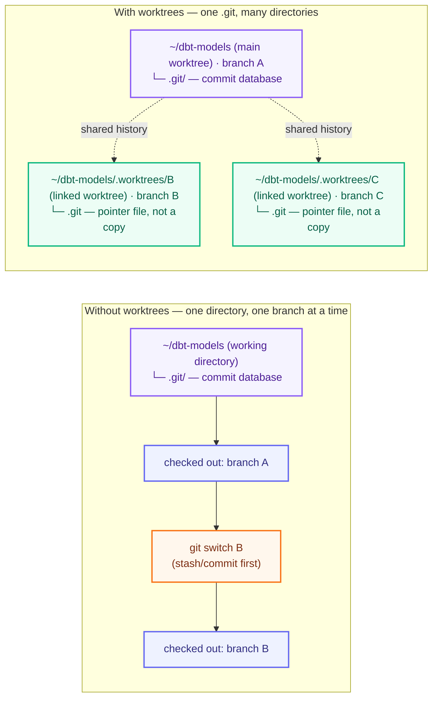

# Worktrees in depth

## One `.git`, many working directories

`.git` is a **directory holding a database**: every commit, branch, and
the history tying them together, stored in git's own object format
rather than plain files. It lives *inside* your working directory, e.g.
`~/dbt-models/.git`, alongside the files you actually edit.

A normal checkout has exactly one working directory with `.git` inside
it, so switching branches means mutating that same directory in place:
stash or commit, then `git switch`, over and over. A worktree adds
another working directory elsewhere on disk, but not its own copy of
`.git`; only the original directory (the **main worktree**) holds the
real database. Every other (**linked**) worktree just holds a small
`.git` *file* pointing back to it, so all of them read and write the
same history:



A worktree's identity is its directory, not its branch; the branch is
just what it's checked out to, set at creation (`cop new`/`git worktree
add`). Git enforces the constraint that makes this safe: the same branch
can never be checked out in two worktrees at once.

## What `cop relocate` moves: the directory, never the branch

`cop relocate` heals a mismatch by renaming the directory on disk. The
branch is not touched: same name, same commits, still checked out when
the move finishes. Say `cop new ~/dbt-models --branch fix-thing`
created a worktree for the new branch `fix-thing`. With the template
`~/worktrees/{{ owner }}/{{ branch }}/{{ repo }}` its directory is
`~/worktrees/acme/fix-thing/dbt-models`: owner `acme`, the branch name
`fix-thing` as the parent segment, and the worktree directory itself
named after the repo, `dbt-models`. Someone later runs
`git switch spike-other` inside it, works there for a while, then
parks the task with `cop park` and moves on. The path's branch
segment still says `fix-thing` while the checkout serves the branch
`spike-other`,
so `cop list` flags the row as `spike-other @ fix-thing/`: the row's
branch is the checked-out one, and the `@ .../` part is the parent
directory's name. The relocate moves the directory to
`~/worktrees/acme/spike-other/dbt-models`, the expected path of the
branch actually checked out there, and updates
git's worktree metadata to match. Branch segment and branch agree
again; the directory name stays `dbt-models` throughout.


What else follows the move depends on how a tool keys its state:

- **The shared `.venv`** follows by itself. There is one real venv
  per repo, in the main checkout; every worktree gets a `.venv`
  symlink to it at creation (a venv's absolute paths can't be copied,
  only shared or rebuilt). The symlink rides along inside the moved
  directory, and its target never moves, so the environment keeps
  working with nothing to reinstall. Only a shell that already
  activated it points at the old path: re-activate from the new one.
- **Git** is not path-keyed at all: branches, refs, and the checkout
  are unaffected, and so is the `cop park` mark (a git config value
  keyed by repo and branch).
- **pi's project memory and skills** key on `basename(cwd)`. That is
  why the example template ends in the repo name: every worktree of a
  repo lands in the same bucket as the main checkout, and a relocate
  only changes the branch segment in the middle, so the bucket name
  survives unchanged. A template ending in the branch segment would
  orphan the bucket on every relocate.
- **pi's sessions** key on the full directory path. They stay behind
  under the old path, still listed in the picker's global view. The
  mechanics and the remedy are below.
- **Editors and terminals** key on the path too: reopen them at the
  new location.

The goal for a parked task: weeks later you come back and keep
working, and the piece that matters most is the environment, since a
rebuilt venv is the expensive part. It survives the move on its own,
as shown above. pi sessions are the one thing left behind. Each
session is one file, `<timestamp>_<id>.jsonl`, in a bucket directory
under `~/.pi/agent/sessions/`. The bucket name is the working
directory, encoded: drop the leading slash, turn the remaining
slashes into dashes, and wrap the result in `--`. Project memory uses
a second, coarser key: `basename(cwd)`, so its bucket is just the
repo name. On disk, before and after the move:

```text
~/
├── dbt-models/  main checkout
│   └── .venv/   the one real venv, shared by every worktree
├── worktrees/acme/
│   ├── fix-thing/
│   │   └── dbt-models/  checked out: spike-other (mismatch), task parked
│   │       └── .venv -> ~/dbt-models/.venv  symlink, rides along
│   └── spike-other/
│       └── dbt-models/  cop relocate moved it here; you return to the parked task
│           └── .venv -> ~/dbt-models/.venv  same symlink, still resolves
└── .pi/agent/
    ├── sessions/  one bucket per full path
    │   ├── --Users-you-worktrees-acme-fix-thing-dbt-models--/    old bucket: sessions stay here
    │   │   ├── 2026-08-04T17-42-29-087Z_019fcdde-….jsonl
    │   │   └── 2026-08-05T09-12-32-318Z_019fd132-….jsonl
    │   └── --Users-you-worktrees-acme-spike-other-dbt-models--/  new bucket: next pi run starts here
    └── projects-memory/  one bucket per repo (basename)
        └── dbt-models/   unchanged by the move
```

`pi --continue` opens the most recent file in the current directory's
bucket, and the `--resume` picker lists that bucket (it can also show
every bucket). The relocate changed the working directory, so your
next `pi` run computes a fresh bucket and the parked sessions no
longer show up locally. They remain visible in the picker's global
view; rename the old bucket to the new encoded path and `--continue`
picks them up again. With a custom `sessionDir` pi also checks the
recorded cwd, so update each moved file's first line too.
